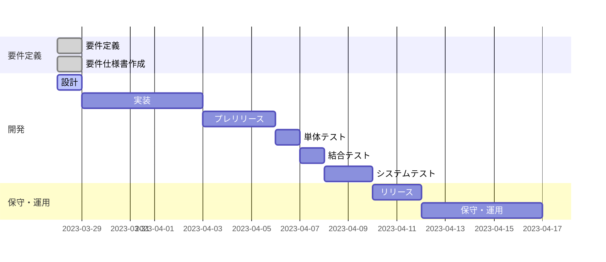
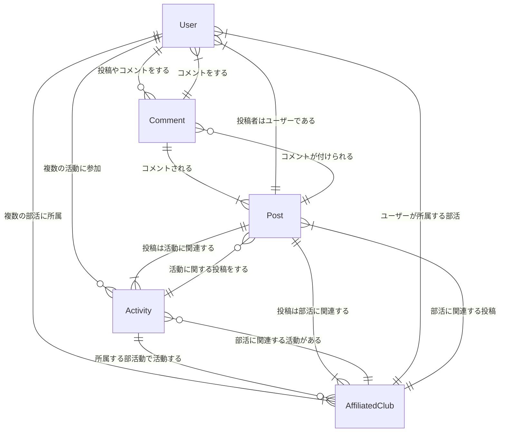

# 要件定義

## サイトの目的や概要

目的:

- 学校の部活動を紹介し、生徒たちが参加したいと思えるような情報を提供すること

概要:

このサイトの目的は、学校の部活動を紹介することで、生徒たちが自分に合った部活動を見つけ、より充実した学校生活を送るための情報提供を行うことです。学校の各部活動の情報を掲載し、活動内容や顧問の紹介、部員の声などを通じて、それぞれの特色や魅力を伝えます。また、部活動への入部に興味を持った生徒たちには、部活動への参加方法やスケジュール、練習風景などを紹介し、入部を促します。さらに、掲示板やコメント機能を通じて、生徒たちが意見交換を行い、交流を深める場を提供します。

## ターゲット

- 中高生や大学生などの学生
- 部活動に所属している人、または部活動に興味がある人
- 部活動の情報を探している人
- 部活動の情報を共有したい人
- 部活動のコミュニティを築きたい人

# 開発ガントチャート

# 要件仕様書

## ユーザー関連

- ユーザーを新規登録できる。
- ユーザーはログイン・ログアウトできる。
- ユーザーは自分のプロフィールを編集できる。
- ユーザーは他のユーザーのプロフィールを閲覧できる。
- ユーザーは部活動に所属できる。
- ユーザーは自分が所属している部活動の一覧を閲覧できる。
- ユーザーは、他のユーザーが所属している部活動の一覧を閲覧できる。
- ユーザーは、他のユーザーの活動回数を閲覧できる。

## 部活動関連

- 部活動を新規作成できる。
- 部活動の詳細情報を編集できる。
- 部活動の一覧を閲覧できる。
- 部活動の詳細情報を閲覧できる。

## 活動関連

- 活動を新規作成できる。
- 活動の詳細情報を編集できる。
- 自分が参加した活動の一覧を閲覧できる。
- 他のユーザーが参加した活動の一覧を閲覧できる。
- 活動の詳細情報を閲覧できる。

## 投稿関連

- 投稿を新規作成できる。
- 投稿の詳細情報を編集できる。
- 自分が投稿した一覧を閲覧できる。
- 他のユーザーが投稿した一覧を閲覧できる。
- 投稿の詳細情報を閲覧できる。

## コメント関連

- コメントを新規作成できる。
- コメントの詳細情報を編集できる。
- 投稿に対して、コメントを閲覧できる。

# 機能設計

## ユーザー機能

- ユーザーの登録、ログイン、ログアウト、プロフィール編集
- 自己紹介の記入、アイコン画像の設定
- 所属している部活動の登録、編集、削除
- 活動回数のカウント

## 部活動機能

- 部活動の作成、編集、削除
- 部活動の詳細情報（説明、ロゴ画像）の設定

## 活動機能

- 活動の作成、編集、削除
- 活動の詳細情報（場所、詳細、日付）の設定
- 活動に参加したユーザーの記録
- 活動に関連する投稿の表示

## 投稿機能

- 投稿の作成、編集、削除
- タイトル、内容、画像の設定
- 投稿に関連する活動、投稿者の情報の表示
- 投稿の閲覧数のカウント

## コメント機能

- 投稿に対してコメントの作成、編集、削除
- コメントの本文、投稿者の情報の表示

# リレーション

# データ設計

## User Data（ユーザーデータ）

| カラム名           | 説明                       | 型        | Unique | Nullable |
| ------------------ | -------------------------- | --------- | ------ | -------- |
| user_id            | ユーザー ID                | Integer   | Yes    | No       |
| user_uid           | ユーザー UID               | String    | Yes    | No       |
| user_name          | ユーザー名                 | String    | No     | No       |
| password           | パスワード                 | String    | No     | No       |
| user_icon          | ユーザーアイコン           | String    | No     | Yes      |
| readme             | 自己紹介                   | String    | No     | Yes      |
| activity_count     | 活動回数                   | Integer   | No     | No       |
| affiliated_club_id | 所属している部活動（複数） | Integer[] | No     | Yes      |
| created_at         | 作成日時                   | DateTime  | No     | No       |
| updated_at         | 更新日時                   | DateTime  | No     | No       |

## Club Data（部活動データ）

| カラム名         | 説明                     | 型       | Unique | Nullable |
| ---------------- | ------------------------ | -------- | ------ | -------- |
| club_id          | 部活動 ID                | Integer  | Yes    | No       |
| club_name        | 部活動名                 | String   | Yes    | No       |
| club_description | 部活動の説明             | String   | No     | Yes      |
| club_logo_image  | 部活動のロゴ画像ファイル | String   | No     | Yes      |
| created_at       | 作成日時                 | DateTime | No     | No       |
| updated_at       | 更新日時                 | DateTime | No     | No       |

## Activity Data（活動データ）

| カラム名         | 説明                    | 型        | Unique | Nullable |
| ---------------- | ----------------------- | --------- | ------ | -------- |
| activity_id      | 活動 ID                 | Integer   | Yes    | No       |
| activity_date    | 活動日                  | Date      | No     | No       |
| activity_place   | 活動場所                | String    | No     | No       |
| activity_detail  | 活動詳細                | Text      | No     | Yes      |
| activity_people  | 活動参加者              | Integer[] | No     | Yes      |
| activity_club_id | 活動が行われた部活動 ID | Integer   | No     | No       |
| created_at       | 作成日時                | DateTime  | No     | No       |
| updated_at       | 更新日時                | DateTime  | No     | No       |

## Post Data（投稿データ）

| カラム名           | 説明                   | 型       | Unique | Nullable |
| ------------------ | ---------------------- | -------- | ------ | -------- |
| post_id            | 投稿 ID                | Integer  | Yes    | No       |
| title              | タイトル               | String   | No     | No       |
| content            | 投稿内容               | Text     | No     | No       |
| poster_user_id     | 投稿者のユーザー ID    | Integer  | No     | No       |
| poster_user_name   | 投稿者のユーザー名     | String   | No     | No       |
| posted_image       | 投稿された画像ファイル | String   | No     | Yes      |
| view_count         | 閲覧数                 | Integer  | No     | No       |
| posted_activity_id | 投稿された活動 ID      | Integer  | No     | No       |
| created_at         | 作成日時               | DateTime | No     | No       |
| updated_at         | 更新日時               | DateTime | No     | No       |

## Comment Data（コメントデータ）

| カラム名            | 説明                       | 型       | Unique | Nullable | default |
| ------------------- | -------------------------- | -------- | ------ | -------- | ------- |
| comment_id          | コメント ID                | integer  | Yes    | No       | No      |
| comment_body        | コメント本文               | text     | No     | No       | No      |
| commenter_user_id   | コメントしたユーザーの ID  | integer  | No     | Yes      | No      |
| commenter_user_name | コメントしたユーザーの名前 | string   | No     | No       | ゲスト  |
| commented_post_id   | コメントされた投稿の ID    | integer  | No     | No       | No      |
| created_at          | 作成日時                   | DateTime | No     | No       | No      |
| updated_at          | 更新日時                   | DateTime | No     | No       | No      |

## Grass Data（草データ）

| カラム名            | 説明                    | 型       | Unique | Nullable |
| ------------------- | ----------------------- | -------- | ------ | -------- |
| grass_id            | 草 ID                   | Integer  | Yes    | No       |
| grass_user_id       | 草を生やしたユーザー ID | Integer  | No     | No       |
| grassed_activity_id | 草を生やされた活動 ID   | Integer  | No     | No       |
| created_at          | 作成日時                | DateTime | No     | No       |
| updated_at          | 更新日時                | DateTime | No     | No       |

# 画面設計

## ホーム画面

- ニュース
- ログイン
- ページネーション
- ログイン時
  - 出席管理
  - プロフィール
  - ログアウト

## IT 画面

- IT 系のニュース
- IT 系の部活リスト
  - 部活名
  - 部活説明
  - 部活ロゴ

## ゲーム画面

- ゲーム系のニュース
- ゲーム系の部活リスト
  - 部活名
  - 部活説明
  - 部活ロゴ

## その他画面

- その他系のニュース
- その他系の部活リスト
  - 部活名
  - 部活説明
  - 部活ロゴ

## プロフィール画面

- プロフィール
- 出席状態の草
- マークダウン

## ログイン画面

- フォーム
- 新規登録のリンク

## 新規登録画面

- タイトル、投稿内容、投稿画像の入力フォーム
- 投稿ボタン

## 投稿作成画面

- フォーム

## 投稿編集画面

- フォーム

## 投稿詳細画面

- 投稿タイトル、投稿者、投稿日時、閲覧数、本文、画像、部活動名
- コメント一覧
- コメント本文、投稿者、投稿日時
- コメント入力フォーム
- 前のページに戻るボタン

## 部活動詳細画面

- 部活動名、説明文、ロゴ画像、活動回数
- 活動一覧
  - 活動日時、場所、詳細、参加者数、投稿数
- 前のページに戻るボタン
