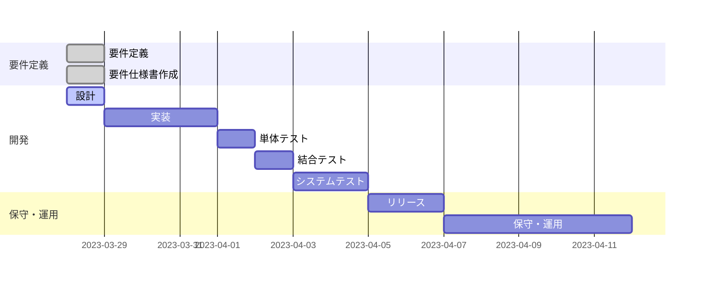
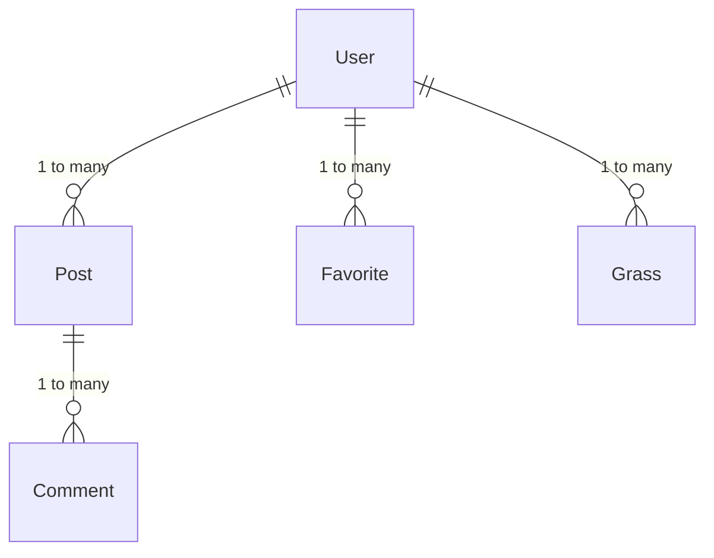

# 要件定義

## サイトの目的や概要

目的:

- 学校の部活動を紹介し、生徒たちが参加したいと思えるような情報を提供すること

概要:

このサイトの目的は、学校の部活動を紹介することで、生徒たちが自分に合った部活動を見つけ、より充実した学校生活を送るための情報提供を行うことです。学校の各部活動の情報を掲載し、活動内容や顧問の紹介、部員の声などを通じて、それぞれの特色や魅力を伝えます。また、部活動への入部に興味を持った生徒たちには、部活動への参加方法やスケジュール、練習風景などを紹介し、入部を促します。さらに、掲示板やコメント機能を通じて、生徒たちが意見交換を行い、交流を深める場を提供します。

## サイトのターゲット層

- 中高生や大学生などの学生
- 部活動に所属している人、または部活動に興味がある人
- 部活動の情報を探している人
- 部活動の情報を共有したい人
- 部活動のコミュニティを築きたい人

# 要件仕様書

## 概要

- 学校内にある部活動について紹介するウェブサイトを作成する
- 部活動に関する情報（部活動名、説明、活動写真、ロゴなど）を掲載する
- ユーザーは登録を行い、投稿やコメントをすることができる
- 投稿には、タイトル、内容、画像の添付が可能である
- ユーザーはお気に入り登録をすることができる
- ユーザーが投稿した記事に、他のユーザーからコメントが可能である
- ユーザーは、草を生やすことができる

## ユーザー管理機能

- ユーザー登録機能
  - ユーザー名、パスワード、メールアドレスの入力が必要
  - 所属している部活動は任意入力
- ログイン機能
  - ユーザー名とパスワードでログイン
- ユーザー情報編集機能
  - ユーザー名、パスワード、メールアドレス、所属している部活動の変更が可能
  - パスワード変更時には現在のパスワードの入力が必要
- ユーザー情報閲覧機能
  - 自分のプロフィールと他のユーザーのプロフィールを閲覧可能
- ユーザーアイコン編集機能
  - 画像ファイルのアップロードにより、ユーザーアイコンを変更可能

## 部活動紹介機能

- 部活動一覧表示機能
  - 部活動名と部活動ロゴ画像を表示する
- 部活動詳細表示機能
  - 部活動名、部活動ロゴ画像、部活動の説明を表示する

## 投稿機能

- 投稿作成機能
  - タイトル、投稿内容、添付画像のアップロードが可能
- 投稿閲覧機能
  - 投稿一覧を表示し、各投稿のタイトル、投稿日時、投稿者のユーザー名、お気に入り登録数を表示する
  - 各投稿をクリックすることで、投稿詳細ページを表示し、タイトル、投稿内容、投稿日時、投稿者のユーザー名、お気に入り登録数、添付画像を表示する
- 投稿編集機能
  - タイトル、投稿内容、添付画像の変更が可能
- 投稿削除機能
  - 投稿を削除することができる
- 投稿コメント機能
  - 投稿に対してコメントを投稿することができる
  - コメント本文、投稿日時、コメント者のユーザー名を表示する

## お気に入り機能

- お気に入り登録機能
  - 自分が投稿した投稿に対してはお気に入り登録できない
- お気に入り解除機能
- お気に入り投稿閲覧機能
  - お気に入り登録した投稿を一覧表示する

## 草機能

- 草表示機能
  - 出席したかを表示する
- 草登録機能
  - ログインした時にデータを登録する

# 開発ガントチャート

# データ設計

## リレーション

## User Data（ユーザーデータ）

| カラム名        | 説明                              | 型      | Unique | Nullable |
| --------------- | --------------------------------- | ------- | ------ | -------- |
| user_id         | ユーザー ID                       | Integer | Yes    | No       |
| user_name       | ユーザー名                        | String  | Yes    | No       |
| password        | パスワード                        | String  | No     | No       |
| email_address   | メールアドレス                    | String  | Yes    | No       |
| user_icon       | ユーザーアイコン                  | Binary  | No     | Yes      |
| affiliated_club | 所属している部活動 (ある場合のみ) | String  | No     | Yes      |

## Club Data（部活動データ）

| カラム名         | 説明                     | 型      | Unique | Nullable |
| ---------------- | ------------------------ | ------- | ------ | -------- |
| club_id          | 部活動 ID                | Integer | Yes    | No       |
| club_name        | 部活動名                 | String  | Yes    | No       |
| club_description | 部活動の説明             | Text    | No     | Yes      |
| club_logo_image  | 部活動のロゴ画像ファイル | Binary  | No     | Yes      |

## Post Data（投稿データ）

| カラム名                    | 説明                                    | 型       | Unique | Nullable |
| --------------------------- | --------------------------------------- | -------- | ------ | -------- |
| post_id                     | 投稿 ID                                 | Integer  | Yes    | No       |
| title                       | タイトル                                | String   | No     | No       |
| content                     | 投稿内容                                | Text     | No     | No       |
| posting_date_time           | 投稿された日時                          | DateTime | No     | No       |
| poster_user_id              | 投稿者のユーザー ID                     | Integer  | No     | No       |
| poster_user_name            | 投稿者のユーザー名                      | String   | No     | No       |
| image_file_attached_to_post | 投稿に添付された画像ファイル (ある場合) | Binary   | No     | Yes      |

## Comment Data（コメントデータ）

| カラム名                  | 説明                       | 型       | Unique | Nullable |
| ------------------------- | -------------------------- | -------- | ------ | -------- |
| comment_id                | コメント ID                | integer  | Yes    | No       |
| comment_body              | コメント本文               | text     | No     | No       |
| comment_posted_date_time  | コメントされた日時         | datetime | No     | No       |
| commenter_user_id         | コメントしたユーザーの ID  | integer  | No     | No       |
| commenter_user_name       | コメントしたユーザーの名前 | string   | No     | No       |
| post_id_of_comment_target | コメント対象の投稿の ID    | integer  | No     | No       |

## Favorite Data（お気に入りデータ）

| カラム名                         | 説明                              | 型       | Unique | Nullable |
| -------------------------------- | --------------------------------- | -------- | ------ | -------- |
| favorite_id                      | お気に入り ID                     | integer  | yes    | no       |
| favorite_registration_date_time  | お気に入り登録された日時          | datetime | no     | no       |
| user_id_that_registered_favorite | お気に入りを登録したユーザーの ID | integer  | no     | no       |
| post_id_of_favorite_target       | お気に入り登録対象の投稿の ID     | integer  | no     | no       |

## Grass Data（草データ）

| カラム名       | 説明                       | 型      | Unique | Nullable |
| -------------- | -------------------------- | ------- | ------ | -------- |
| user_id        | ユーザー ID                | integer | yes    | no       |
| date           | アクティビティがあった日付 | date    | yes    | no       |
| activity_count | 日付ごとのアクティビティ数 | integer | no     | yes      |
